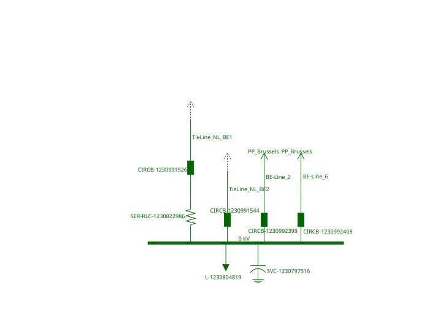
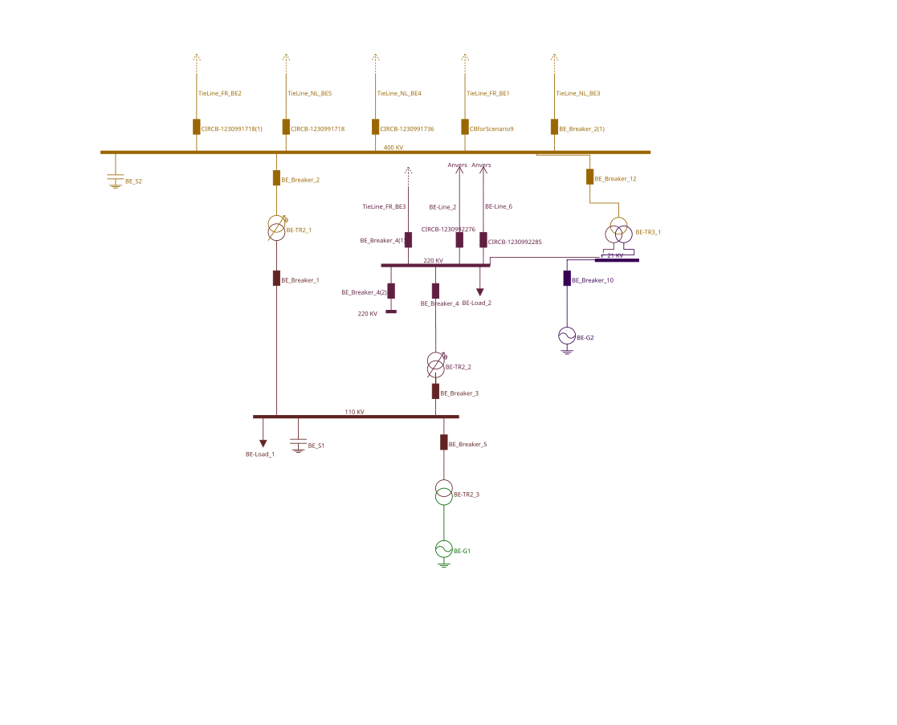

# Modelling Element Disconnection by Monitoring the Power Flow (Last Line Disconnection)

The test case should be performed as follows:

1)  Open the CGM model or [IGM Belgovia](https://github.com/entsoe-tso/relicapgrid/tree/main/Instance/Grid/IGM_Belgovia).

2)  Import the list of SIPS from Remedial Action Profile ([Belgovia_RA.xml](https://github.com/entsoe-tso/relicapgrid/blob/main/Instance/NetworkCode/Belgovia/Belgovia_instance/Belgovia_RA.xml)).

3)  Check if SIPS was uploaded correctly and the logic is as expected.

4)  Import the Contigency List from Contingency Profile ([Belgovia_CO_SIPS.xml](https://github.com/entsoe-tso/relicapgrid/blob/main/Instance/NetworkCode/Belgovia/Belgovia_instance/Belgovia_CO_SIPS.xml)).

5)  Run contingency analysis including SIPS activation.

6)  Check if SIPS was triggered correctly:

- For contingency on breaker in line BO-Line_2 the power in that line should drop to 0 MW;

- SIPS should open the breaker CIRCB-1230991544 in HVDC link TieLine_GA_BO2.

Test data was prepared based on Belgovia individual grid model. The elements connected to the Alfvik substation were used:

- The triggering action is the disconnection of only one line -- BO-Line_2, which is realized by checking if the power flow in the terminal (mRID 77f04391-aa23-49b6-b3e9-6089130bb5d5) to which the line is connected is less than 1 MW.

- The action is to switch-off the HVDC link TieLine_GA_BO2 which is done by opening the breaker CIRCB-1230991544 (mRID 484536e9-762a-49a3-9970-d60b9fae03fe).

- The SIPS model was prepared in file named: [Belgovia_RA_SIPS_UC4_Last_Line_Disconnection.xml](https://github.com/entsoe-tso/relicapgrid/blob/main/Instance/NetworkCode/Belgovia/Belgovia_instance/SIPS/SIPS_UC4_Last_Line_Disconnection_Belgovia.xml)

- To force the power drop on line BO-Line_2 to less than 1MW, the opening of a breaker at the other end of the line (in PP_Brussia substation) is simulated by adding this breaker (CIRCB-1230992276, mRID 3b394dab-ab47-4022-98be-8123c6dfe7d4) into contingency list ([Belgovia_CO_SIPS.xml](https://github.com/entsoe-tso/relicapgrid/blob/main/Instance/NetworkCode/Belgovia/Belgovia_instance/Belgovia_CO_SIPS.xml)):

