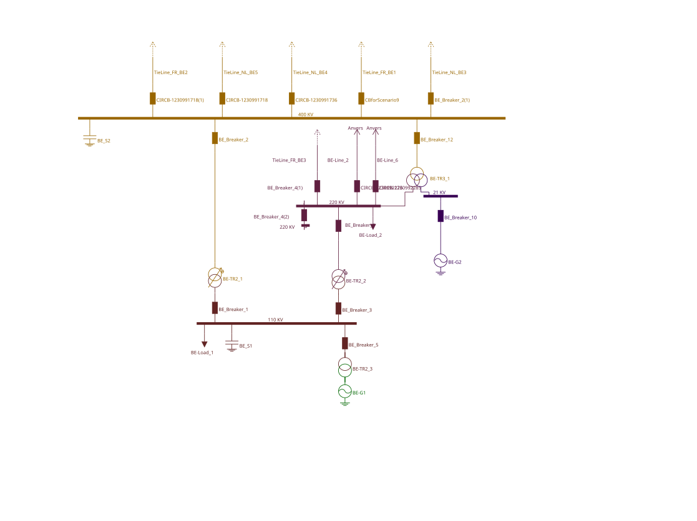

# Modelling Voltage Dependent Tripping Conditions (Overvoltage Protection)

The test case should be performed as follows:

1)  Open the CGM model or [IGM Belgovia](https://github.com/entsoe-tso/relicapgrid/tree/main/Instance/Grid/IGM_Belgovia).

2)  Import the list of SIPS from Remedial Action Profile ([Belgovia_RA.xml](https://github.com/entsoe/relicapgrid/blob/cgmes-3.0_ncp-2.4_tc-1.1/Instance/NetworkCode/Belgovia/Belgovia_instance/SIPS/Belgovia_RA_SIPS_UC5_Overvoltage.xml)).

3)  Check if SIPS was uploaded correctly and the logic is as expected.

4)  Perform the load flow and check the voltage on 110 kV busbars BO-Busbar_6 in PP_Brussia substation. Adjust the reactive power generation on generator BO-G1 to achieve a voltage of 124 kV on 110 kV busbars BO-Busbar_6.

5)  Import the Contingency List from Contingency Profile ([Belgovia_CO_SIPS.xml](https://github.com/entsoe/relicapgrid/blob/cgmes-3.0_ncp-2.4_tc-1.1/Instance/NetworkCode/Belgovia/Belgovia_instance/Belgovia_CO_SIPS.xml)).

6)  Run contingency analysis including SIPS activation.

7)  Check if SIPS was triggered correctly:

- For contingency on transformer BE-TR2_2 in PP_Brussia substation the voltage on 110 kV busbars BO-Busbar_6 should exceed 125 kV;

- SIPS should open the breaker BO_Breaker_1 for transformer BO-TR2_1.

Test data was prepared based on Belgovia individual grid model. The elements connected to the 110 kV busbars of PP_Brussia substation were used:

As a trigger conditions the voltage on 110 kV busbars BO-Busbar_6 (Terminal mRID a1f42404-a01c-6abb-28c6-4c582f23b62d) is monitored and if it exceeds certain value (in this case set to 125 kV) then the SIPS is activated.

As an action the opening of BO_Breaker_1 (mRID 38dfcc80-600f-44e2-8f71-fb595b4f00ac) is performed.
