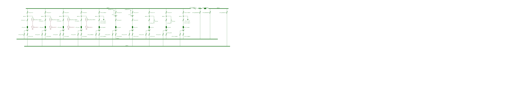

# Modelling complex SIPS logic (Automatic Generation Shedding)

The test case should be performed as follows:

1)  Open the CGM model or [IGM Svedala](https://github.com/entsoe-tso/relicapgrid/tree/main/Instance/NetworkCode/Svedala/Svedala_instance).

2)  Import the list of SIPS from Remedial Action Profile ([SIPS_UC7_Generation-Shedding_Svedala.xml](https://github.com/entsoe/relicapgrid/blob/cgmes-3.0_ncp-2.4_tc-1.1/Instance/NetworkCode/Belgovia/Belgovia_instance/SIPS/SIPS_UC7_Generation-Shedding_Svedala.xml))

3)  Check if SIPS was uploaded correctly and the logic is as expected.

4)  Import the Contingency List from Contingency Profile ([Svedala_CO_SIPS.xml](https://github.com/entsoe/relicapgrid/blob/cgmes-3.0_ncp-2.4_tc-1.1/Instance/NetworkCode/Belgovia/Belgovia_instance/SIPS/SIPS_Svedala_CO.xml)).

5)  Make sure that line CL6 PATL and TATL limits are set sufficiently to overload the line in contingency case. Adjusting PATL and TATL limits of line if needed, remembering that TATL limit should be higher than PATL limit.

6)  Run contingency analysis including SIPS activation.

7)  Check if SIPS was triggered correctly:

    a.  For initial overload of line CL6 above TATL limit the SIPS 1 was activated, and:

        i.  After first LF&CA generator HÄLLAN_G1 was disconnected

        ii. After second LF&CA SIPS 1 acted as intended (depending on the overload)

    b.  For initial overload of line CL6 above PATL but below TATL the SIPS 2 was activated, and:

        i.  After first LF&CA generator HÄLLAN_G1 power was set to 10 MW

        ii. After second LF&CA SIPS 2 acted as intended (depending on the overload)

Test data was prepared based on Svedala individual grid model. The elements connected to the HÄLLAN CT72 substation were used:

To simplify the test case SIPS is monitoring only one line CL6, considering:

- PATL limit (mRID 02abc849-a241-bd01-ca44-a13e3e46d3bd) and

- TATL limit (mRID 0a60b94d-13e6-43ad-1135-09fe81afb5a4) pinned to the line Terminal.

SIPS acts on two generators connected to the same busbars as the line CL6:

- HÄLLAN_G1 and

- HÄLLAN_G3.

If the action is to disconnect the generator then the:

- Breaker CT72_G1-S (mRID ecc7d452-3cc6-4a6f-ac55-cfc80f3aac53) for HÄLLAN_G1 or

- breaker CT72_G3-S (mRID dafeb217-8a10-4068-b88a-2e884a2bdc32) for HÄLLAN_G3

is opened.

Otherwise the action is to set the active power of the generator:

- HÄLLAN_G1 (mRID 4e0971d4-db4c-441d-a9f2-c88d4c04f60b) or

- HÄLLAN_G3 (mRID 2a35657f-a1a8-45dc-911e-e71535b35d87)

to Pmin which is 10 MW in this case.

- The SIPS models were prepared in file named: SIPS_UC7_Generation-Shedding_Svedala.xml

- To force the overload in line CL6 the loss of two elements:

<!-- -->

- line CL7 (mRID b676e63f-e89a-4bd7-b786-95fe458298eb) and

- load CT72_T1_LAST (mRID ebf0cd8b-a357-4e97-aa67-de5b263733d6)

<!-- -->

- Was added to the contingency list (SIPS \_Svedala_CO.xml) as an exceptional contingency.

- To properly test the case also adjusting PATL and TATL limits of line CL6 may be needed, remembering that TATL limit should be higher than PATL Limit.
